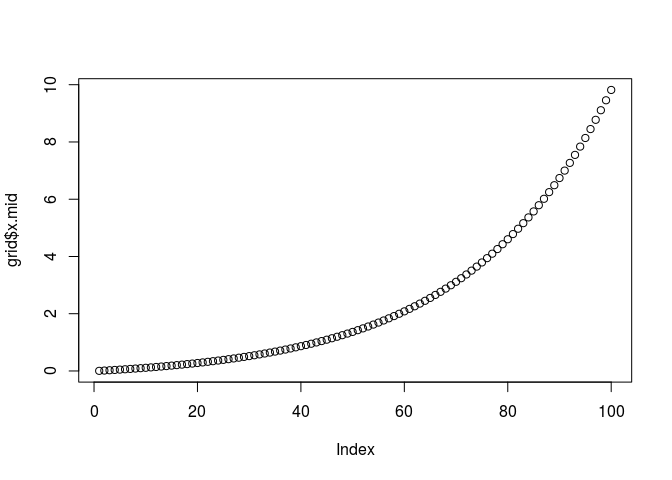
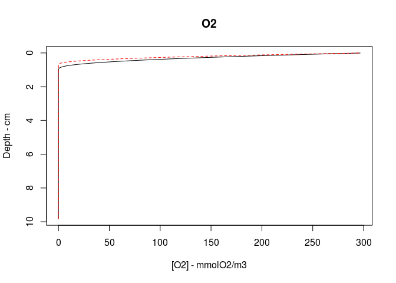
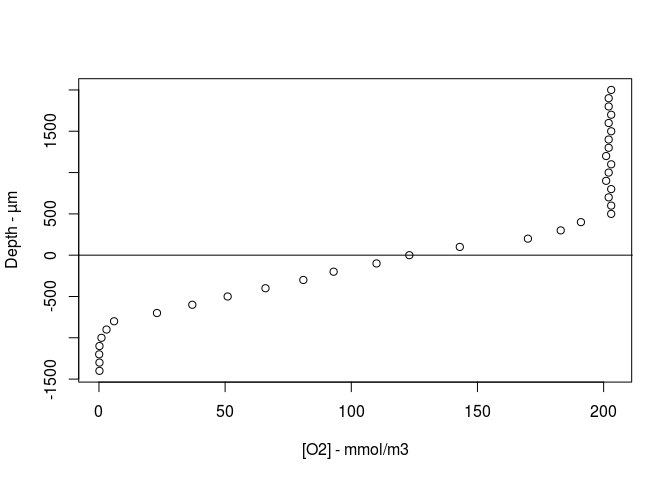
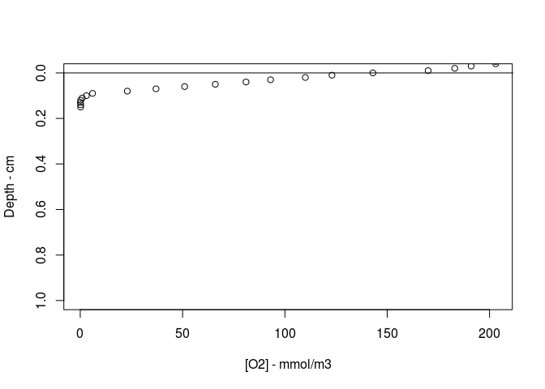
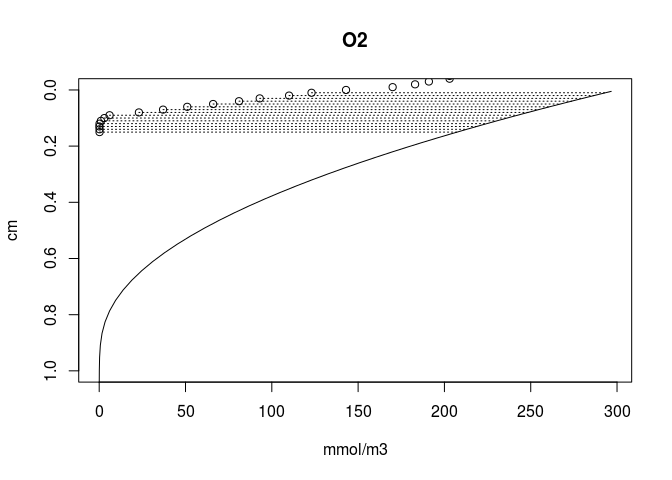
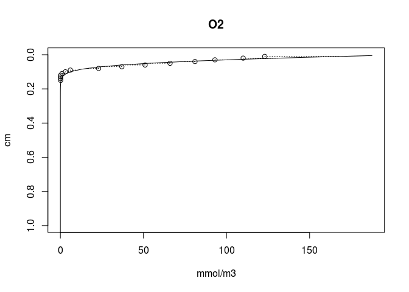
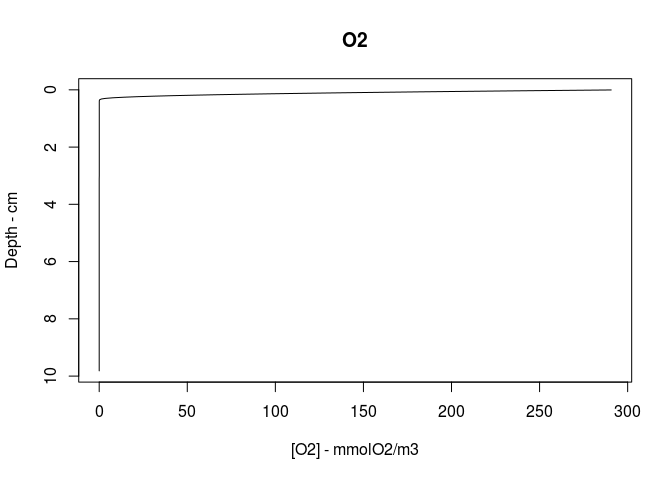
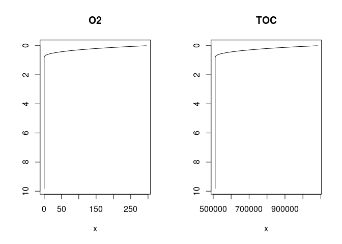
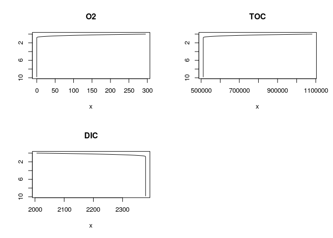

Oxygen in porous non-permeable sediments
================
Arthur Capet, Marilaure Grégoire, Karline Soetaert
July 2019

-   [Set-up](#set-up)
    -   [1. Libraries](#libraries)
    -   [2. Grid](#grid)
    -   [3. Model](#model)
    -   [4. Parameters](#parameters)
-   [Simulation](#simulation)
-   [Exercise 1 : Diagnostics](#exercise-1-diagnostics)
-   [Infering parameters and diagnostics from observations](#infering-parameters-and-diagnostics-from-observations)
    -   [Cost Function](#cost-function)
-   [Exercise 2 : Bio-irrigation](#exercise-2-bio-irrigation)
-   [Exercise 3 : O2 + Organic Matter](#exercise-3-o2-organic-matter)
-   [Exercise 4 : O2 + Organic Matter + DIC](#exercise-4-o2-organic-matter-dic)
-   [Exercise 5 : Nitrogen cycle](#exercise-5-nitrogen-cycle)

Set-up
======

We start with a simple diffusive model for oxygen, considering a constant respiration rate above a certain depth.

For this we need

1. Libraries
------------

``` r
require(ReacTran, quietly = TRUE) # Reaction-Transport models in aquatic systems 
require(marelac, quietly = TRUE)  # toolbox for aquatic sciences
```

2. Grid
-------

We define a vertical 1D grid with 100 levels over 10cm. It is good to have finer spatial resolution in the upper cells, where steeper gradients occur.

``` r
grid <- setup.grid.1D(N = 100, L = 10, dx.1 = 0.01)
plot(grid$x.mid)
```



3. Model
--------

The unique **state variable** is *O*<sub>2</sub>(*z*, *t*), the oxygen concentration in pore waters, given in *m**m**o**l* *m*<sub>*l**i**q**u**i**d*</sub><sup>−3</sup>. We consider **diffusion** and constant **respiration** above a certain depth.
$$\\frac{\\partial O\_2(z)}{\\partial t}=\\frac{\\partial O\_2(z)}{\\partial t}|\_{transport}+\\frac{\\partial O\_2(z)}{\\partial t}|\_{consumption}$$

$$ \\frac{\\partial O\_2(z)}{\\partial t} = \\frac{\\partial}{\\partial z}\[ D \\frac{\\partial C}{\\partial z }\]  - \\gamma (z) $$
 For boundary conditions, we impose :

-   constant concentration at the sediment-water interface
    *O*<sub>2</sub>|<sub>*z* = 0</sub> = *O*<sub>2, *B**W*</sub>
-   nul gradient at the lower cell
    $$\\frac{\\partial O\_2}{\\partial z}|\_{z=\\mathrm{deepest cell}}=0$$

This model is expressed as a **model function** that receives **current time** (t), **current state** (O2) and **parameters** (p) and returns **time derivatives**.

``` r
O2model <- function (t, O2, p) {
  with (as.list(p), {
    # Transport term (using ReacTran routines)
    O2tran <- tran.1D(C = O2, C.up = O2BW, D = D, VF = porosity, dx = grid)
    # Respiration
    O2cons <- minrate*(O2/(O2+ks))    
    
    dO2<-O2tran$dC - O2cons
    # The model function returns the time derivatives as first argument.
    # The next arguments in the list are diagnostics that can be used for later visualisation.
    return( list(dO2, O2cons = O2cons) ) 
  })
}
```

4. Parameters
-------------

``` r
parms <- c(
  porosity = 0.8    , # -
  minrate  = 1000   , # mmol/m3/d - oxygen consumption rate
  O2BW     = 300    , # mmol/m3      - bottom water oxygen concentration
  ks       = 1      , # mmol O2/m3 - Half saturation constant
  D        = as.numeric(diffcoeff(species="O2", S=35.7, t=24)*86400*1e4)/(1-log(0.8*0.8)) # cm2/d - molecular diffusion coefficient, corrected for tortuosity
)
```

Simulation
==========

To solve the model and plot the ouput we first need to define initial conditions. Then, we'll use the package `deSolve` to solve the model differential equations. For a dynamic solution (resolving the system evolution with time) we use the function `ode`. This function requires the time steps `times` at which we'll compute the new model states. We also specify that we model one species (*nspec*), and give a name to this species (*names*).

``` r
# Define initial conditions
IC <- rep(200, times = length(grid$x.mid))

# computes the dynamical solution for `parms`
out  <- ode.1D(times=seq(0,10,.1),
               y = IC,
               parms = parms,
               func = O2model,
               nspec = 1,
               names = "O2")

# plot the output
image(out, ylim=c(3,0), grid=grid$x.mid, legend=TRUE, ylab="Sediment Depth - [cm]")
```


The system converges towards an equilibrium solution.

Instead of computing the full dynamical evolution of the system, from the initial conditions until it reaches the steady state, it is possible to compute directly the steady-state solutions. The problem is to find *C* such that $\\frac{\\partial C}{\\partial t}=0$. For this, the package `rootSolve` provides a function answering our needs : `steady.1D`.

``` r
# computes the steady-state solution
out  <- steady.1D(y = IC, parms = parms, func = O2model, nspec = 1, names = "O2", pos=TRUE)
plot(out, xyswap = TRUE, xlab = "mmol/m3", ylab = "cm", grid = grid$x.mid)
```


Exercise 1 : Diagnostics
========================

Add the oxygen flux at the sediment-water interface as another diagnostic value to the list returned by the `O2model` (in addition to the time derivatives). The value can be found from the list returned by the function `tran.1D`: `O2tran$flux.up`.

**Q**: Explore how the oxygen profile and the oxygen flux at the sediment water interface at steady state vary when a parameter is modified.

``` r
#Redefine the model function 'O2model' with an additional diagnostic (O2flux=..) in the list returned at the end of the function.

O2model <- function (t, O2, p) {
  with (as.list(p), {
    # Transport term (using ReacTran routines)
    O2tran <- tran.1D(C = O2, C.up = O2BW, D = D, VF = porosity, dx = grid)
    # Respiration
    O2cons <- minrate*(O2/(O2+ks))    
    
    dO2<-O2tran$dC - O2cons
    # The model function returns the time derivatives as first argument.
    # The next arguments in the list are diagnostics that can be used for later visualisation.
    return( list(dO2, O2cons = O2cons, O2flux=O2tran$flux.up/100) ) 
  })
}

#Recompute the model solution, and check the value of the O2 flux at the interface. 
out  <- steady.1D(y = IC, parms = parms, func = O2model, nspec = 1, names = "O2", pos=TRUE)

print(paste0(format(out$O2flux, digits=5),' mmolO2/m2/d'))
```

    ## [1] "6.9675 mmolO2/m2/d"

``` r
#Create a new vector with new parameter values: `parms2`

parms2 <- c(
  porosity = 0.8    , # -
  minrate  = 2000   , # mmol/m3/d - oxygen consumption rate
  O2BW     = 300    , # mmol/m3      - bottom water oxygen concentration
  ks       = 1      , # mmol O2/m3 - Half saturation constant
  D        = as.numeric(diffcoeff(species="O2", S=35.7, t=24)*86400*1e4)/(1-log(0.8*0.8)) # cm2/d - molecular diffusion coefficient, corrected for tortuosity
)

#Compute the new steady-state solution : out2

out2  <- steady.1D(y = IC, parms = parms2, func = O2model, nspec = 1, names = "O2", pos=TRUE)

#Plot both solution on a graph   ( use `plot(out,out2,...) `)

plot(out,out2, xyswap = TRUE, xlab= '[O2] - mmolO2/m3', ylab='Depth - cm', grid = grid$x.mid)
```



``` r
#Compare the fluxes from out and out2
print('Diffusive flux at the sediment interface for parms')
```

    ## [1] "Diffusive flux at the sediment interface for parms"

``` r
print(paste0(format(out$O2flux, digits=5),' mmolO2/m2/d'))
```

    ## [1] "6.9675 mmolO2/m2/d"

``` r
print('Diffusive flux at the sediment interface for parms2')
```

    ## [1] "Diffusive flux at the sediment interface for parms2"

``` r
print(paste0(format(out2$O2flux, digits=5),' mmolO2/m2/d'))
```

    ## [1] "9.8531 mmolO2/m2/d"

**When you're done,** execute the following code chunks in Rstudio, to explore interactively the role of each parameter.

( you might have to execute : `install.packages('shiny', repos='https://cran.rstudio.com/')` )

``` r
library(shiny)
runApp('Shiny_ODia.R')
```

Infering parameters and diagnostics from observations
=====================================================

Based on a number of assumptions :

-   The oxygen profile can be considered to be at steady state.
-   Diffusion is the only relevant transport process.

We can consider that the flux at the interface is directly related to the vertical profile of oxygen.

This means that the shape of the oxygen profile can be used to infer the flux at the interface.

Data have been stored in a .csv file.

``` r
filename='O2mud1.csv'  #  'O2mud1.csv' 
O2data<-read.csv(filename)
plot( x = O2data$O2,y=O2data$depth, ylab='Depth - µm', xlab='[O2] - mmol/m3')
lines(x=c(-50,250),y=c(0,0))
```



First, we need to convert the depth unit, and adapt the depth of the SWI.

``` r
O2data$depth <- -(O2data$depth-100)/10000
```

``` r
plot( x = O2data$O2,y=O2data$depth, ylab='Depth - cm', xlab='[O2] - mmol/m3', ylim=c(1,0))
lines(x=c(-50,250),y=c(0,0))
```



Playing with parameters you can visually attempt to identify parameters that bring the model curve close to the observation. Still, this is very subjective.

Cost Function
-------------

To adjust the parameters we first have to quantify the model misfit, ie. we need a function that receives a set of parameter and returns the residuals (ie, the difference between the measured *O*<sub>2</sub> and those predicted by the diffusion model at the depths of measurements).

To compare model outputs with observations, we first have to extract model value at the depth of measurements. One way to charachterize the error then would be to sum the distances between observed and simulated values.

$$ Error = \\sqrt{\\sum\\limits\_{i=1}^{N\_{obs}} \\left(O\_{i} - M\_{i} \\right)^2}$$

``` r
O2data$O2model <- approx( x= grid$x.mid,y=out$y[,'O2'],xout = O2data$depth)$y

plot(out, xyswap = TRUE, xlab = "mmol/m3", ylab = "cm", grid = grid$x.mid, ylim=c(1,0))
points(   x = O2data$O2 ,
          y=O2data$depth,
          ylab='Depth - cm',
          xlab='[O2] - mmol/m3',
          xlim=c(0,400))
# points( x = O2data$O2model, y=O2data$depth, col='red' )
for (i in (1:nrow(O2data))){
  lines(x=c(O2data$O2[i],O2data$O2model[i]),y=c(O2data$depth[i],O2data$depth[i]),lty=3)
}
```



``` r
# removing observation above sediment interface for which model has no value. 
O2data <- O2data[which(O2data$depth>0),]
Error <- sqrt(sum((O2data$O2model-O2data$O2)^2))
print(Error)
```

    ## [1] 814.942

Here's an app that will allow you to try and find the best parameters to render the observations. Obviously, there were some noise in the measurement, so a perfect match is not possible. How low can you bring the error ?

``` r
library(shiny)
runApp('Shiny_ODia_Data.R')
```

With an objective measure of the model error, we can now automate the calibration procedure. This can be done with the FME package.

First we need a function that receives a set of parameters as input, and return the corresponding error.

``` r
ErrorFunction <- function(p) {
  parmslocal <- parms           # We first copy the initial parameter vector
  parmslocal[names(p)] <- p
  out  <- steady.1D(y = IC, parms = parmslocal, func = O2model, nspec = 1, names = "O2", pos=TRUE)
  O2data$O2model <- approx( x= grid$x.mid,y=out$y[,'O2'],xout = O2data$depth)$y
  O2data <- O2data[which(O2data$depth>0),]
  Error <- sqrt(sum((O2data$O2model-O2data$O2)^2))
  #return(  Error )  
  return(  O2data$O2model-O2data$O2 )  
}
```

We can now use the function `modFit` from the `FME` package to find the set of parameters that minimize the residuals given by `ErrorFunction`.

``` r
#First we know that bottom water concentration is equal to saturation value. 
parms["O2BW"]<- gas_satconc(S = 37.5, t = 24.45, species = "O2") 

# Call the function modFit and store the output in `Fita`

library(FME)
```

    ## Loading required package: coda

``` r
Fitout <- modFit(f = ErrorFunction,
               p = parms[c('minrate','ks')],
               method="Pseudo",
               lower=c(0,0),
               upper=c(10e4,20))
```

`Fita` is now an object of the class modFit, which contains a number of attributes, and which can be used as an argument to certain functions as illustrated below

-   `summary` gives statistics on the calibration procedure
-   `coef` returns the value of the best-fitting parameters

``` r
# What is the value of the fitted parameters, and the standard error on those parameters ? 
summary(Fitout)
```

    ## 
    ## Parameters:
    ##         Estimate Std. Error t value Pr(>|t|)
    ## minrate 80843.28   53346.48   1.515    0.154
    ## ks         20.00      43.76   0.457    0.655
    ## 
    ## Residual standard error: 15.6 on 13 degrees of freedom
    ## 
    ## Parameter correlation:
    ##         minrate     ks
    ## minrate  1.0000 0.9774
    ## ks       0.9774 1.0000

``` r
# How to obtain a vector with the best parameters ? 
coef(Fitout)
```

    ##  minrate       ks 
    ## 80843.28    20.00

Those functions provides us with errors on the parameters of the model, that originate from the noise on the measurements. The error on the parameters can be used to infer the error on the fluxe estimates.

``` r
FluxatSteadyStatefunction <- function(p) {
  parmslocal <- parms           # We first copy the initial parameter vector
  parmslocal[names(p)] <- p
  out  <- steady.1D(y = IC,
                    parms = parmslocal,
                    func = O2model, 
                    nspec = 1,
                    names = "O2", 
                    pos=TRUE)

  O2flux <- sum(out$O2cons*parmslocal['porosity']*grid$dx)/100
  #return(  Error )  
  return(  c('O2flux'= O2flux))  
}
  
sr<-summary(Fitout)

minvalues <- coef(Fitout)- sr$par[,2]
maxvalues <- coef(Fitout)+ sr$par[,2]

parRange <- data.frame( min = pmax(minvalues,0), max = maxvalues)

sensout<- sensRange(func=FluxatSteadyStatefunction,
        parms   = coef(Fitout),
        sensvar = 'O2flux',
        parRange=parRange
        )
```

The resulting estimate for the diffusive oxygen flux at the interface is thus 42.87 +/- 9.938

``` r
hist(sensout$O2flux, breaks = seq(from=0,to=100,by=1))
```


``` r
parms[names(coef(Fitout))]<-coef(Fitout)

out  <- steady.1D(y = IC, parms = parms, func = O2model, nspec = 1, names = "O2", pos=TRUE)

O2data$O2model <- approx( x= grid$x.mid,y=out$y[,'O2'],xout = O2data$depth)$y

plot(out, xyswap = TRUE, xlab = "mmol/m3", ylab = "cm", grid = grid$x.mid, ylim=c(1,0))
points(   x = O2data$O2 ,
          y=O2data$depth,
          ylab='Depth - cm',
          xlab='[O2] - mmol/m3',
          xlim=c(0,400))
# points( x = O2data$O2model, y=O2data$depth, col='red' )
for (i in (1:nrow(O2data))){
  lines(x=c(O2data$O2[i],O2data$O2model[i]),y=c(O2data$depth[i],O2data$depth[i]),lty=3)
}
```



Exercise 2 : Bio-irrigation
===========================

Bioirrigation can be represented in 1D models by allowing non-local exchange, ie. by adding a transport term *α*(*C*(*z*)−*C*(0)) by which solutes are exchanged between any depth *z* and bottom water, without having to diffuse through near-surface sediments.

**Q**: Add a biorrigation term to the equations for O2.

-   Start by copying the O2 model.
-   Within the model function, create a vector of irrigation rates: *α*. It should have a fixed value *α*<sub>0</sub> (e.g. a parameter `alpha`) above a given depth (e.g. a parameter `irrigdepth`), and 0 below.
-   Add a term *O*2*i**r**r**i**g*(*z*)=*α*(*z*)\[*O*<sub>2</sub>(*z*)−*O*<sub>2</sub>(0)\] to the time derivative of *O*<sub>2</sub>.
-   Provide the following diagnostics :

    -   Diffusive flux, provided from the transport terms.
    -   Irrigative flux, computed by integrating the irrigation terms $\\int\\limits\_\\infty^0\\phi(z)\\alpha(z)\[ O\_2(z) - O\_2(0)\]dz$ (*d**z* can be obtained from `grid$dx`)

``` r
O2modelIRR <- function (t, O2, p) {
  with (as.list(p), {
    # Transport term (using ReacTran routines)
    O2tran <- tran.1D(C = O2, C.up = O2BW, D = DO2, VF = porosity, dx = grid)
    
    # Respiration
    O2cons <- minrate*(O2/(O2+ks))    
    
    #Irrigation 
    alpha    <- alpha0*(grid$x.mid < irrigdepth)
    O2irrig  <- - alpha * (O2-O2BW)
    
    dO2<-O2tran$dC - O2cons + O2irrig
    
    # The model function returns the time derivatives as first argument.
    # The next arguments in the list are diagnostics that can be used for later visualisation.
    return( list(dO2, O2cons = O2cons,
                 O2flux=O2tran$flux.up/100,
                 O2IRRflux = sum(porosity*O2irrig*grid$dx)/100) ) 
  })
}

parmsIRR <- c(
  porosity  = 0.8    , # - Porosity (does not change with depth)
  minrate   = 8000   , # mmol/m3/d - mineralisation rate
  O2BW      = 300    , # nmol/cm3  - bottom water oxygen concentration
  DO2       = as.numeric(diffcoeff(species="O2")*86400*1e4)/(1-log(0.8*0.8)),     # cm2/d - molecular diffusion coefficient
  ks        = 1      , # mmol/m3 - Oxygen limitation for oxic respiration
  alpha0    = 1      , # /d - Irrigation coefficient
  irrigdepth  = 3      # cm - Irrigation Depth
)


outIRR  <- steady.1D(y = IC, parms = parmsIRR, func = O2modelIRR, nspec = 1, names = "O2", pos=TRUE)

#Plot both solution on a graph  
plot(outIRR, xyswap = TRUE, xlab= '[O2] - mmolO2/m3', ylab='Depth - cm', grid = grid$x.mid)
```



``` r
#Compare the fluxes from out and out2
print('Diffusive flux at the sediment interface')
```

    ## [1] "Diffusive flux at the sediment interface"

``` r
print(paste0(format(outIRR$O2flux, digits=5),' mmolO2/m2/d'))
```

    ## [1] "19.756 mmolO2/m2/d"

``` r
print('Irrigation flux at the sediment interface')
```

    ## [1] "Irrigation flux at the sediment interface"

``` r
print(paste0(format(outIRR$O2IRRflux, digits=5),' mmolO2/m2/d'))
```

    ## [1] "7.0677 mmolO2/m2/d"

**Variant**

For an interactive version of a similar model, execute the following code chunks in Rstudio. Here the respiration rate has been set as constant (not limited by oxygen availability). Therefore, whenever oxygen is lacking to support respiration, it was considered that a 'Oxygen Demanding Unit' would be created. This addditonal variable represents reduced substances resulting from further redox reactions.

``` r
library(shiny)
runApp('Shiny_ODia_ODU_Irrig.R')
```

Exercise 3 : O2 + Organic Matter
================================

Let us now consider more realistic respiration rates by introducing a solid state variable for organic matter.

The equations of the system looks like this :

-   Organic Matter

$$ \\frac{\\partial TOC(z)}{\\partial t} = \\underbrace{\\frac{\\partial}{\\partial z}\[ D\_b \\frac{\\partial TOC}{\\partial z }\]}\_{bioturbation}  - \\underbrace{\\gamma. TOC.\\frac{O\_2}{O\_2+k\_{O\_2lim}}}\_{resp}$$

-   Oxygen

$$ \\frac{\\partial O\_2(z)}{\\partial t} = \\underbrace{\\frac{\\partial}{\\partial z}\[ D\_{O\_2} \\frac{\\partial O\_2(z)}{\\partial z }\]}\_{diffusion} 
- \\underbrace{\\gamma. TOC.\\frac{1-\\phi}{\\phi}.\\frac{O\_2}{O\_2+k\_{O\_2lim}}}\_{oxic ~respiration} \\\\
- \\underbrace{\\alpha (O\_2(z)-O\_2(0))}\_{irrigation}$$

-   For the boundary conditions of the solid fractions we impose `OMflux`: the sedimenting organic matter input.

``` r
grid <- setup.grid.1D(N = 100, L = 10, dx.1 = 0.01)

TOCmodel <- function (t, S, p) {
  with (as.list(p), {
    O2<-S[1:100]
    TOC<-S[101:200]

    # Transport term (using ReacTran routines)
    O2tran <- tran.1D(C = O2, C.up = O2BW, D = DO2, VF = porosity, dx = grid)
    TOCtran <- tran.1D(C = TOC, flux.up = OMflux , D = Dbioturb, VF = 1- porosity, dx = grid)
    
    # Respiration
    resp  <- TOC*minrate*(O2/(O2+ks))   # ! per volume of SOLIDS !
    respL <- resp*(1-porosity)/porosity # ! per volume of LIQUID !
    
    #Irrigation 
    alpha    <- alpha0*(grid$x.mid < irrigdepth)
    O2irrig  <- - alpha * (O2-O2BW)

    dO2  <-  O2tran$dC - respL  + O2irrig
    dTOC <-  TOCtran$dC - resp
  
    return( list(cbind(dO2,dTOC),
                 O2resp = respL,
                 O2flux = O2tran$flux.up/100,
                 O2irrigflux = sum(porosity*O2irrig*grid$dx)/100,
                 OrgC=TOC*12*1e-9/2.5*100) # Convert to percent of dry weight.
            ) 
  })
}

parms <- c(
  porosity  = 0.8    , # -
  minrate   = 1/100   , # /d - mineralisation rate
  OMflux    = 1000    , # nmol/cm2/d Flux of Organic Matter
  O2BW      = 300    , # nmol/cm3       - bottom water oxygen concentration
  DO2       = as.numeric(diffcoeff(species="O2")*86400*1e4)/(1-log(0.8*0.8)),     # cm2/d - molecular diffusion coefficient
  ks        = 1     , # Oxygen limitation for oxic respiration
  alpha0    = 0      , # Irrigation coefficient
  irrigdepth  = 3    , # Irrigation Depth
  Dbioturb   = 1/365      # cm2/d Bioturbation coeficient
)

ICO2 <- rep.int(c(300),length(grid$x.mid))
ICTOC <- rep.int(c(.03),length(grid$x.mid))

IC<-cbind(ICO2,ICTOC)

# computes the steady-state solution
DefaultRun  <- steady.1D(y = IC, parms = parms, func = TOCmodel, nspec = 2, names = c("O2","TOC"),pos=T)
plot(DefaultRun,xyswap=T,grid=grid$x.mid)
```



Interactive version:

``` r
library(shiny)
runApp('Shiny_ODia_TOC.R')
```

Exercise 4 : O2 + Organic Matter + DIC
======================================

**Q:** Add a solute variable DIC to the previous model.

``` r
require(marelac)
require(ReacTran)

grid <- setup.grid.1D(N = 100, L = 10, dx.1 = 0.01)

TOCDICmodel <- function (t, S, p) {
  with (as.list(p), {
    O2<-S[1:100]
    TOC<-S[101:200]
    DIC<-S[201:300]

    # Transport term (using ReacTran routines)
    O2tran <- tran.1D(C = O2, C.up = O2BW, D = DO2, VF = porosity, dx = grid)
    DICtran <- tran.1D(C = DIC, C.up = DICBW, D = DDIC, VF = porosity, dx = grid)
    TOCtran <- tran.1D(C = TOC, flux.up = OMflux , D = Dbioturb, VF = 1- porosity, dx = grid)
    
    # Respiration
    resp  <- TOC*minrate*(O2/(O2+ks))  # ! per volume of SOLIDS !
    respL <- resp*(1-porosity)/porosity # ! per volume of LIQUID !
    
    #Irrigation 
    alpha    <- alpha0*(grid$x.mid < irrigdepth)
    O2irrig  <- - alpha * (O2-O2BW)
    DICirrig  <- - alpha * (DIC-DICBW)

    dO2  <-  O2tran$dC - respL  + O2irrig
    dDIC  <-  DICtran$dC + respL  + DICirrig
    dTOC <-  TOCtran$dC - resp
  
    return( list(cbind(dO2,dTOC,dDIC),
                 O2resp = respL,
                 O2flux = O2tran$flux.up/100,
                 O2irrigflux = sum(porosity*O2irrig*grid$dx)/100,
                 OrgC=TOC*12*1e-9/2.5*100) # Convert to percent of dry weight.
            ) 
  })
}

parms <- c(
  porosity  = 0.8    , # -
  minrate   = 1/100   , # /d - mineralisation rate
  OMflux    = 1000    , # nmol/cm2/d Flux of Organic Matter
  O2BW      = 300    , # nmol/cm3       - bottom water oxygen concentration
  DICBW      = 2000    , # nmol/cm3       - bottom water oxygen concentration
  DO2       = as.numeric(diffcoeff(species="O2")*86400*1e4)/(1-log(0.8*0.8)),     # cm2/d - molecular diffusion coefficient
  DDIC       = as.numeric(diffcoeff(species="CO2")*86400*1e4)/(1-log(0.8*0.8)),     # cm2/d - molecular diffusion coefficient
  ks        = 1     , # Oxygen limitation for oxic respiration
  alpha0    = 0      , # Irrigation coefficient
  irrigdepth  = 3    , # Irrigation Depth
  Dbioturb   = 1/365      # cm2/d Bioturbation coeficient
)

ICO2 <- rep.int(c(300),length(grid$x.mid))
ICTOC <- rep.int(c(.03),length(grid$x.mid))
ICDIC <- rep.int(c(3000),length(grid$x.mid))

IC<-cbind(ICO2,ICTOC,ICDIC)

# computes the steady-state solution
DefaultRun  <- steady.1D(y = IC, parms = parms, func = TOCDICmodel, nspec = 3, names = c("O2","TOC","DIC"),pos=T)
plot(DefaultRun,xyswap=T,grid=grid$x.mid)


plot(DefaultRun,xyswap=T,grid=grid$x.mid, which = 'OrgC')
```



Exercise 5 : Nitrogen cycle
===========================

-   Add ammonium and nitrate.
-   Ammonium is produced from OM mineralisation (e.g. consider a C/N ratio of 10).
-   Nitrification can be expressed as `Nitri = rnit*NH3*O2/(O2+ksO2nitri)`
-   As before, compute first the total respiration on the basis of the TOC variable.
-   Total resp is then partitioned by computing first the relative importance of the different pathways :

    -   `Oxicminlim = O2/(O2+ksO2oxic)`
    -   `Denitrilim = (1-O2/(O2+kinO2denit)) * NO3/(NO3+ksNO3denit)`, ie. denitrification is limited by nitrate and inhibited by oxygen.
    -   `Anoxiclim  = (1-O2/(O2+kinO2anox))*(1-NO3/(NO3+kinNO3anox))`, anoxic mineralisation is inhibited by both nitrate and oxygen.
    -   `Rescale    = 1/(Oxicminlim+Denitrilim+Anoxiclim)`, we normalize, so that the three mineralisation pathways sum to 1.
-   The oxydants consumption is then provided by

    -   `OxicMin    = totresp*Oxicminlim*Rescale` : Oxic mineralisation
    -   `Denitrific = totresp*Denitrilim*Rescale` : Denitrification
    -   `AnoxicMin  = totresp*Anoxiclim *Rescale` : Anoxic mineralisation, ie. ODU production

Solution : This is actually the complete OMEXDIA model ! Find the code and online version at : <http://www.rforscience.com/modelling/omexdia/> .
